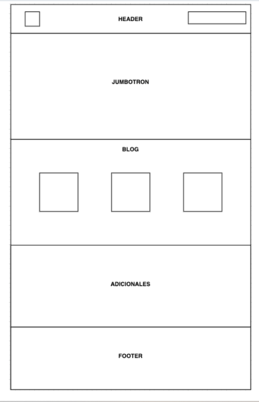

# PROYECTO 1: Landing de Negocio
# Daniela Pizar

- Las secciones siguientes:
  - **a. Header**
    Sección que involucra el logo y las áreas principales del sitio.
  - **b. Jumbotron**
    Sección de presentación del producto al usuario. Debe de incluir su título, descripción y un elemento para introducir tu correo.
  - **c. Blog o catálogo**
    Sección para mostrar los artículos del sitio web. O en su caso, artículos de catálogo de productos
  - **d. Adicionales**
    Secciones diversas que puedes agregar para dar mayor valor a tu sitio.
  - **e. Footer**
    Sección que incluye todas las áreas del sitio, incluyendo redes sociales.

Este Sitio [GitHub Pages proyect Venta](https://github.com/Danypizar/ucamp-venta).

hi

